# Lab 02: Ingest data with a pipeline

### Estimated Duration: 120 Minutes

## Overview

In this lab, you will learn how to use Data Factory pipelines in Microsoft Fabric to implement data ingestion solutions. You will create a pipeline that uses a Copy Data activity to copy data from an external source into your lakehouse, and then use a Spark notebook to transform the ingested data and load it into a table. Finally, you will modify the pipeline to include the notebook as part of the workflow.

## Objectives

In this lab, you will complete the following tasks:

 - Task 1: Create a pipeline
 - Task 2: Create a notebook
 - Task 3: Modify the pipeline

## Architecture Diagram

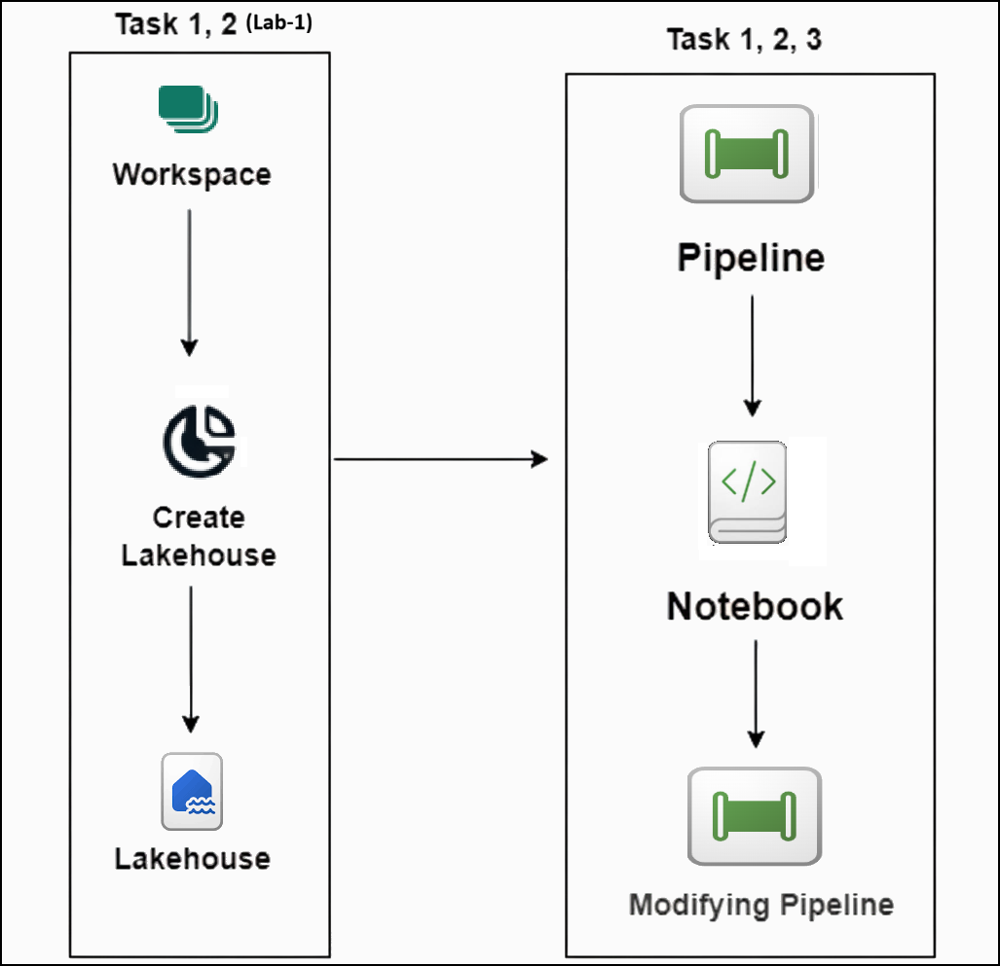

## Use Data Factory pipelines in Microsoft Fabric

A data lakehouse is a common analytical data store for cloud-scale analytics solutions. One of the core tasks of a data engineer is to implement and manage the ingestion of data from multiple operational data sources into the lakehouse. In Microsoft Fabric, you can implement *extract, transform, and load* (ETL) or *extract, load, and transform* (ELT) solutions for data ingestion through the creation of *pipelines*.

Fabric also supports Apache Spark, enabling you to write and run code to process data at scale. By combining the pipeline and Spark capabilities in Fabric, you can implement complex data ingestion logic that copies data from external sources into the OneLake storage on which the lakehouse is based, and then uses Spark code to perform custom data transformations before loading it into tables for analysis.

## Task 1: Create a pipeline

In this task, you will create a pipeline that ingests data from an external source into your lakehouse. You will use a Copy Data activity to copy the data, and then use a Spark notebook to transform the ingested data and load it into a table.

1. Select your **Lakehouse (1)**, then open **Get data (2)** and choose **New pipeline (3)**.

    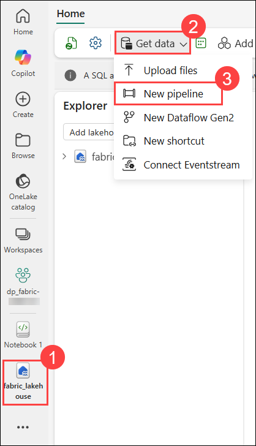

1. Create a new data pipeline named **Ingest Sales Data (1)** and click **Create (2)**.

    

1. If the **Copy Data into Lakehouse** wizard doesn't open automatically, select **Copy Data** in the pipeline editor page.

1. In the **Copy Data into Lakehouse** wizard, on the **Choose a data source (1)** page, in the **New sources (2)** section, search **Http (3)** and select **Http (4)**.

    

1. You will be taken to the Connect to data source pane.

1. In the **Connect to data source** pane, provide the following details:
    - **URL (1)**: `https://raw.githubusercontent.com/MicrosoftLearning/dp-data/main/sales.csv`
    - **Connection (2)**: Create new connection
    - **Connection name (3)**: *Specify a unique name*
    - **Authentication kind (4)**: Basic
    - **Username (5)**: *Enter a unique username and note it down*
    - **Password**: *Enter a unique password and note it down*
    - Select **Next (6)** to continue.

        

1. Set the **Request method (1)** to **GET** and leave the remaining fields unchanged. Select **Next (2)** to continue.

    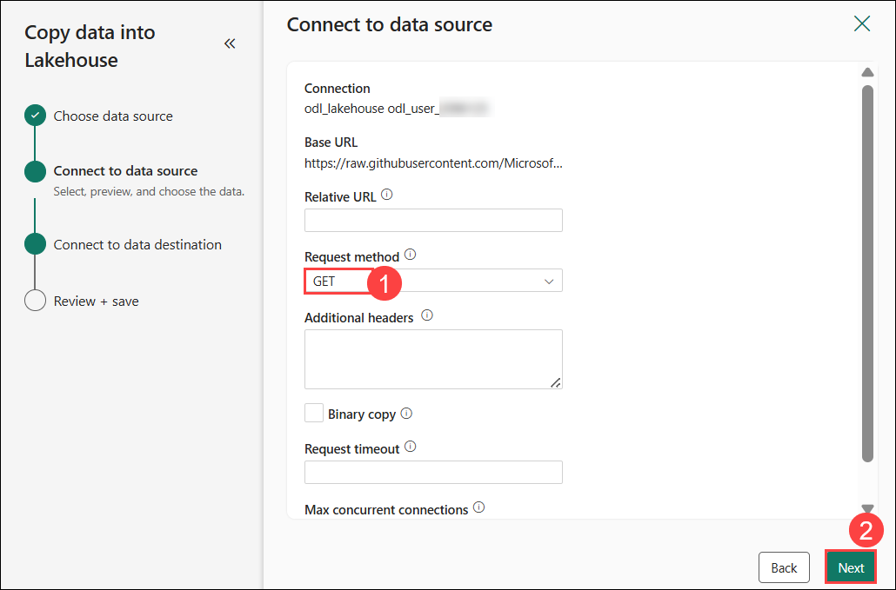

1. After the data is sampled, verify the following settings:
    - **File format (1)**: DelimitedText
    - **Column delimiter (2)**: Comma (,)
    - **Row delimiter (3)**: Default (\r, \n, or \r\n)
    - **First row as header (4)**: Selected
    - **Compression type (5)**: No compression  
    - Then select **Next (6)**.

        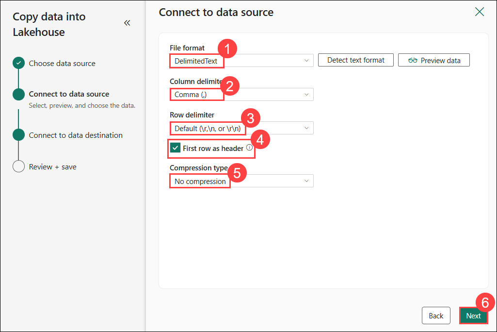

1. Configure the data destination with the following settings:
    - **Root folder (1)**: Files
    - **Folder path (2)**: new_data
    - **File name (3)**: sales.csv
    - **Copy behavior**: None  
    Then select **Next (4)** twice.

        

1. On the **Copy summary** page, review the details of your copy operation and then select **Save + Run**.

    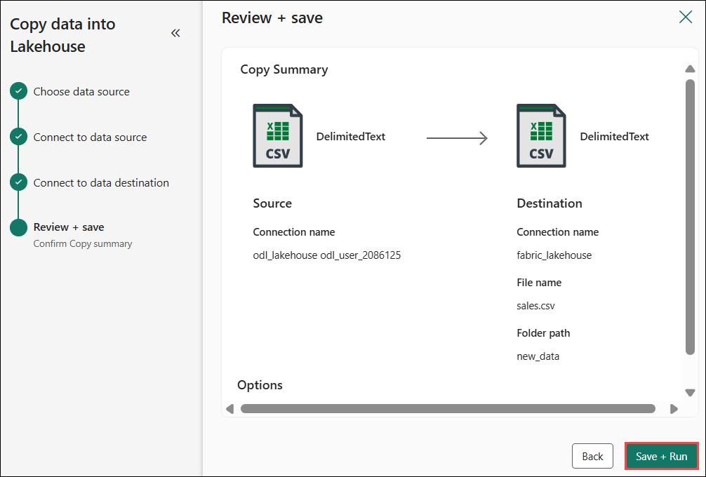

1. A new pipeline containing a **Copy Data** activity is created:

    

1. When the pipeline starts to run, you can monitor its status in the **Output** pane under the pipeline designer. Use the **&#8635;** (*Refresh*) icon to refresh the status, and wait until it has succeeded.

    

1. In the menu bar on the left, select your **Lakehouse**.

    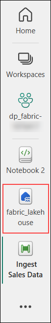

1. Refresh and expand **Files (1)** and select the **new_data (2)** folder to verify that the **sales.csv (3)** file has been copied.

    

## Task 2: Create a notebook

In this task, you will create a Spark notebook to transform the ingested data and load it into a table. You will then run the notebook to verify that the data is correctly transformed and loaded.

1. On the **Home** page for your lakehouse, click on the **3-dots (1)** and select the **Open notebook (2)** menu, then click on **New notebook (3)**.

   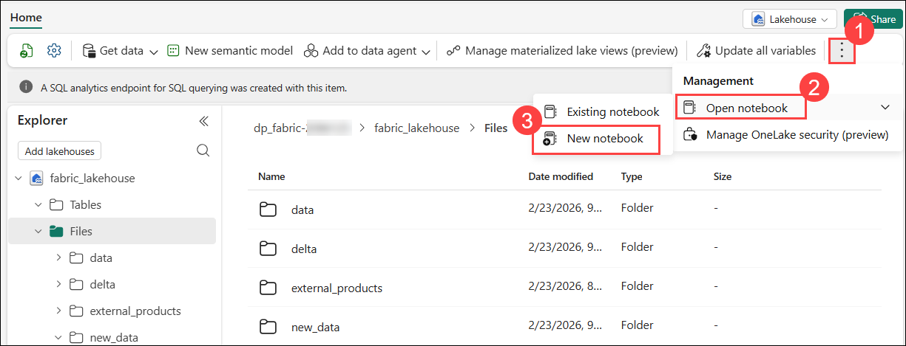

    After a few seconds, a new notebook containing a single *cell* will open. Notebooks are made up of one or more cells that can contain *code* or *markdown* (formatted text).

1. Select the existing cell in the notebook, which contains some simple code, and then replace the default code with the following variable declaration.

    ```python
   table_name = "sales"
    ```

1. Open the **ellipsis (1)** menu for the cell and select **Toggle parameter cell (2)** to mark this cell as a parameter cell for pipeline runs.

    

1. Below the parameters cell, select **+ Code (1)** to insert a new code cell, then paste the transformation code into that cell (2).

    ```python
   from pyspark.sql.functions import *

   # Read the new sales data
   df = spark.read.format("csv").option("header","true").load("Files/new_data/*.csv")

   ## Add month and year columns
   df = df.withColumn("Year", year(col("OrderDate"))).withColumn("Month", month(col("OrderDate")))

   # Derive FirstName and LastName columns
   df = df.withColumn("FirstName", split(col("CustomerName"), " ").getItem(0)).withColumn("LastName", split(col("CustomerName"), " ").getItem(1))

   # Filter and reorder columns
   df = df["SalesOrderNumber", "SalesOrderLineNumber", "OrderDate", "Year", "Month", "FirstName", "LastName", "EmailAddress", "Item", "Quantity", "UnitPrice", "TaxAmount"]

   # Load the data into a table
   df.write.format("delta").mode("append").saveAsTable(table_name)
    ```

    

    This code loads the data from the sales.csv file that was ingested by the **Copy Data** activity, applies some transformation logic, and saves the transformed data as a table - appending the data if the table already exists.

1. Verify that your notebooks look similar to this, and then use the **&#9655; Run all** button on the toolbar to run all of the cells it contains.

    

1. After the notebook run completes, open the ⚙️ **Settings (1)** panel and update the **Name (2)** of the notebook to **Load Sales**, then close the pane.

    

1. In the **Explorer** pane of your Lakehouse, from the eplipses menu **(1)** of Tables, click on **Refresh (2)**.  Then expand **Tables**, and select the **sales (3)** table to see a preview of the data it contains.

   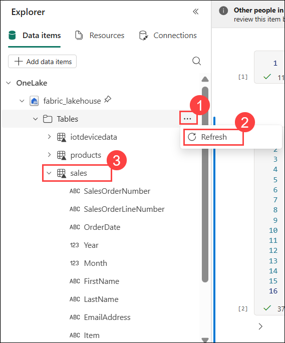

## Task 3: Modify the pipeline

In this task, you will modify the pipeline you created in Task 1 to include the notebook you created in Task 2. This will allow you to run the notebook as part of the pipeline workflow, enabling you to automate the data transformation and loading process.

1. In the left navigation menu bar, select the **Ingest Sales Data** pipeline you created previously.

1. Open the **Activities (1)** tab, select the **More activities (2)** menu, and choose **Delete data (3)**. Drag the new Delete data activity to the left of the Copy data activity and connect its **On completion** output to Copy data.

    

    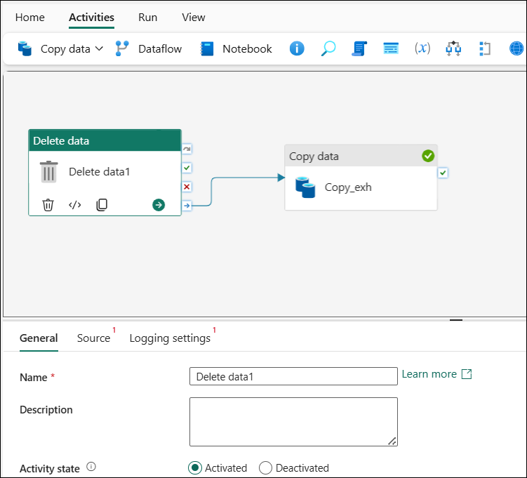

1. Select the **Delete data** activity and, in the pane below the canvas, set **General (1)** → **Name (2)** to **Delete old files**.

    

1. In the **Source** section, configure the following:
    - **Connection**: Click on the dropdown menu **(1)** and select **Browse all (2)**. On the Choose a data source to get started, select your **Lakehouse (3)**.  
    - **File path type (4)**: Wildcard file path  
    - **Folder path (5)**: Files/new_data
    - **Wildcard file name (6)**: *.csv  
    - **Recursively (7)**: Selected

        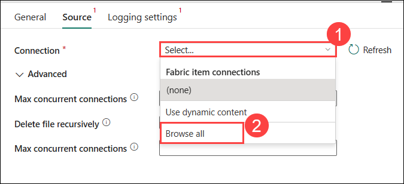

        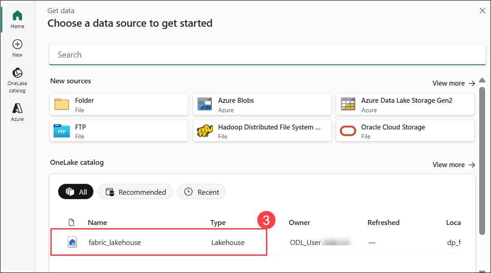

        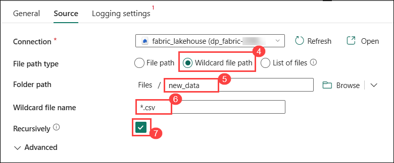                

1. In the **Logging settings**, ensure **Enable logging** is **unselected**.

    

    >**Note:** These settings will ensure that any existing .csv files are deleted before copying the **sales.csv** file.

1. In the pipeline designer, select **Notebook** to add a **Notebook** activity to the pipeline.

    

1. Select the **Copy data** activity and then connect its **On completion** output to the **Notebook** activity as shown here:

    

1. Select the **Notebook** activity, and then in the pane below the design canvas, set the following properties:
    - **General**:
        - **Name**: Load Sales notebook

            
    
    - **Settings**:
        - **Notebook (1)**: Load Sales
        - **Base parameters (2)**: *Add a new parameter with the following properties:*
            
            | Name | Type | Value |
            | -- | -- | -- |
            | table_name | String | new_sales |

            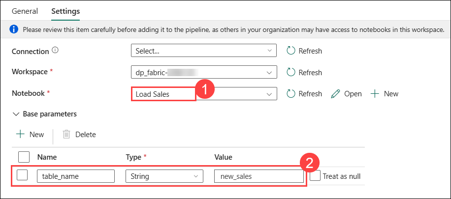

    The **table_name** parameter will be passed to the notebook and override the default value assigned to the **table_name** variable in the parameters cell.

1. On the **Home (1)** tab, use the **&#128427;(2)** (*Save*) icon to save the pipeline. Then use the **&#9655; Run (3)** button to run the pipeline, and wait for all of the activities to complete.

    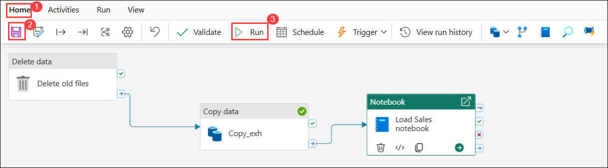

1. Navigate to your **Lakehouse** from the left navigation menu. 

    

1. In the **Explorer** pane, refresh and expand **Tables** and select the **new_sales** table to see a preview of the data it contains. This table was created by the notebook when it was run by the pipeline.

   

## Summary

In this lab, you have gained hands-on experience with using Data Factory pipelines in Microsoft Fabric to implement data ingestion solutions. You created a pipeline that uses a Copy Data activity to copy data from an external source into your lakehouse, and then used a Spark notebook to transform the ingested data and load it into a table. Finally, you modified the pipeline to include the notebook as part of the workflow, enabling you to automate the data transformation and loading process.

### You have successfully completed the lab.

By completing the **Work with Delta Lake and Data Factory pipelines in Microsoft Fabric** hands-on lab, you have gained practical experience in working with **Microsoft Fabric Lakehouses** and **Data Factory Pipelines** to manage and process data efficiently. You learned how to store and manage data using **Delta Lake tables**, enabling reliable, scalable, and versioned data processing through Apache Spark.

Additionally, you designed and implemented automated **ETL workflows using Fabric pipelines** to ingest, transform, and load data into your lakehouse. You also explored how to use Spark notebooks for data transformation and how to integrate them into your pipelines for end-to-end automation.

Overall, you have developed essential skills in leveraging Microsoft Fabric's capabilities for building robust data engineering solutions, enabling you to efficiently manage and analyze data in a modern data architecture.

